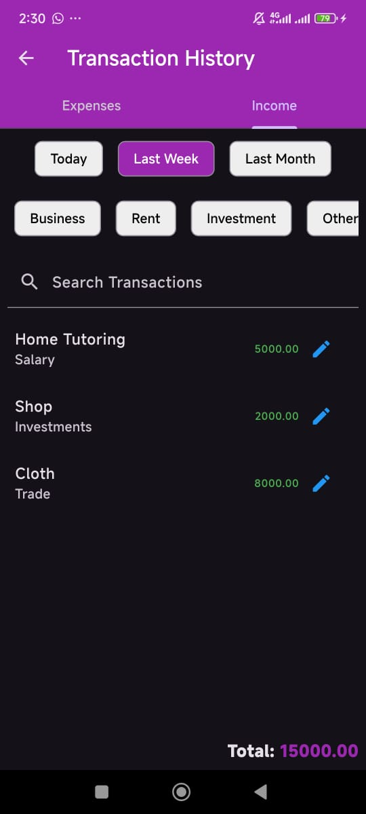

# FinTrack - An Income Expense Tracker App

Pouch Planner is an intuitive expense tracker app designed to help users manage and monitor their finances. The app provides essential features like setting a budget, viewing statistics, and managing various expenses through an easy-to-use interface. It also offers a smooth navigation experience with a bottom navigation bar for quick access to different app sections, including the Home page, Add Expense Page, Add Income Page, Budget page, Reports page, Transaction History Page, Categories Page, Settings page, and a Splash Screen on startup.
 
 

> [!NOTE]
> This app was made in order to submit it as a final project for my Mobile App Development Course organized by EDGE Digital Training Skills for Students Program, IIUC, to my Instructor Noor Mohammed Anik Sir, Batch CBI-018.

<!--diff
@@ This app was made in order to submit it as a final project for my Mobile App Development Course organized by EDGE Digital Training Skills for Students Program, IIUC, to my Instructor Noor Mohammed Anik Sir, Batch CBI-018. @@
-->
## Features

- *Splash Screen*: Displays an animated logo that grows and shrinks during app startup.
- *Welcome Page*: Allows users to do registration and later registered user can sign in using email and password
- *Home Page*: Displays an overview of user expenses and financial summary.
- *Add Expense Page*: Allows users to add their expenses according to selected category with Date & Note.
- *Add Income Page*: Allows users to add their income according to selected category with Date & Note.
- *Budget Page*: Allows users to set and track their monthly budgets.
- *Savings Page*: Allows users to add their savings according to categories.
- *Categories Page*: Allows users to add their expenses according to categories.
- *Transaction History Page*: Allows users to see their expenses or income transaction histories according to Date, also can be filtered by categories.
- *Reports Page*: Visual representation of user expense data, including charts and graphs.
- *Settings Page*: Provides options for managing dark mode, PIN security, and developer information.
- *Side Drawer Bar*: Seamless navigation between the app’s main pages.

## Screenshots

### Languages, tools, framework & Database
- Dart
- Android Studio/VS Code
- Flutter
- Firebase

## Project Setup

Follow the steps below to set up and run this project locally:

### Prerequisites

- [Flutter](https://flutter.dev/docs/get-started/install) (version 2.0 or higher)
- [Dart](https://dart.dev/get-dart)
- A suitable IDE (e.g., [VS Code](https://code.visualstudio.com/) or [Android Studio](https://developer.android.com/studio))

### Dependencies
dependencies
-  provider - A state management solution for managing and listening to app state changes.
-  pie_chart - A widget library for creating visually appealing pie charts.
-  intl - Provides internationalization and localization utilities, including date and number formatting.
-  shared_preferences - Stores simple key-value pairs locally on the device for persistent user settings.
-  fl_chart - A chart library for creating beautiful and customizable charts, such as line and bar graphs.
-  firebase_core - This is responsible for connecting your Flutter app to your Firebase project.
-  firebase_database - It is a cloud-hosted NoSQL database that stores data as JSON and synchronizes it in real-time across all connected clients.
-  firebase_auth - Allows developers to implement secure and user-friendly authentication mechanisms in their applications without having to build them from scratch.
-  firebase_storage - A service provided by Google Firebase for storing and serving user-generated content like images, videos, audio, and other files.
-  cloud_firestore - Allows developers to store, sync, and query data for web, mobile, and server applications.
-  image_picker - Used to pick images and videos from a device's gallery or camera.
-  intl_phone_number_input - A popular plugin used to add an internationalized phone number input field to your app.

dev_dependencies:
-  flutter_lints - Rules and guidelines used in Flutter development to help maintain a clean, consistent, and error-free codebase.

### Clone the Repository

bash
git clone https://github.com/AfrinaNoor/expense_income_tracker_app.git
cd expense_income_tracker_app
flutter pub get
flutter run

## 🔗 Screen Recordings

- [App Screen Recording]()

### 🔗 Presentation Slide
- [Presentation Slide](assets/FinTrack.pdf)